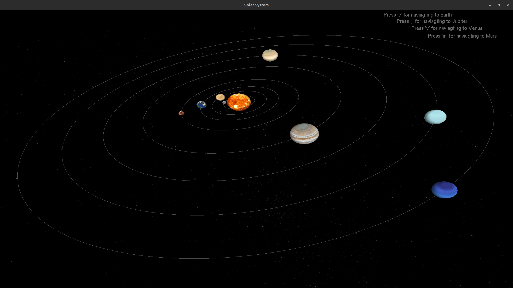
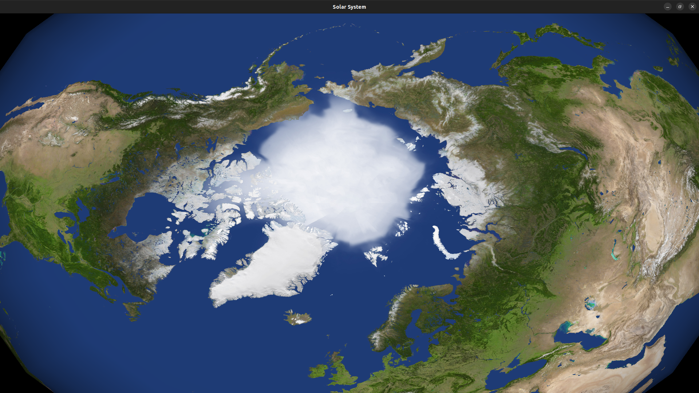
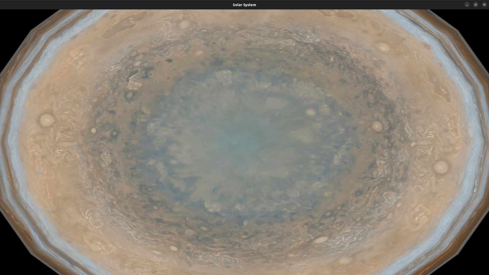
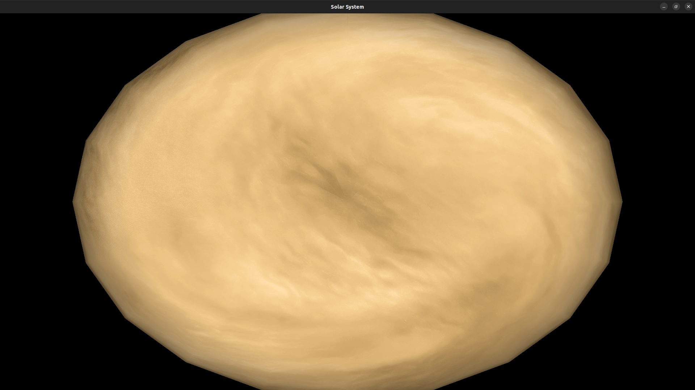
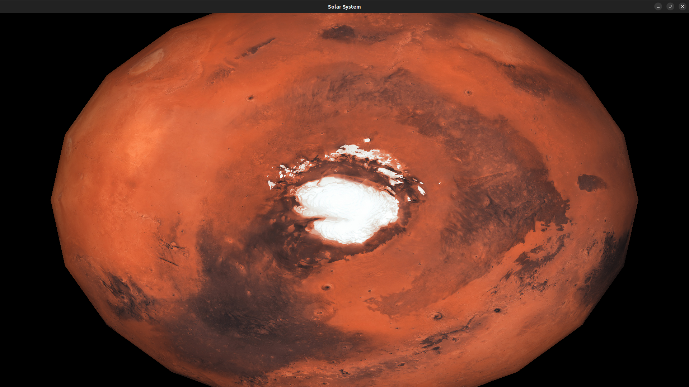

# Solar System Computer Graphics Project

A comprehensive 3D Solar System simulation built with OpenGL and C++, featuring interactive planetary exploration, animated scenes, and immersive graphics.

## 🌟 Project Overview

This project is a Computer Graphics course assignment that demonstrates advanced OpenGL programming concepts including:
- 3D planetary modeling and texturing
- Real-time animation and physics simulation
- Interactive user controls and navigation
- Multi-scene environment with unique gameplay elements
- Lighting and material effects

## 🚀 Features

### Solar System Model
- **Complete Solar System**: All 8 planets (Mercury, Venus, Earth, Mars, Jupiter, Saturn, Uranus, Neptune) plus the Sun
- **Realistic Orbits**: Planets orbit around the Sun with accurate relative speeds
- **3D Texturing**: High-resolution textures for each celestial body
- **Dynamic Lighting**: Realistic lighting effects simulating solar illumination
- **Interactive Navigation**: Navigate between planets using keyboard controls

### Interactive Planetary Scenes

#### 🌍 Earth Scene
- **Day/Night Cycle**: Toggle between day and night views with 'N' key
- **Animated Elements**:
  - Moving cars and boats
  - Floating clouds
  - Flying airplanes
  - Waving flags
  - Traffic lights
- **Urban Environment**: Houses, trees, and infrastructure
- **Real-time Animation**: Smooth 60 FPS animations

#### 🪐 Venus Scene - Space Combat Game
- **UFO Combat Game**: Interactive space shooter gameplay
- **Controls**:
  - Arrow keys for UFO movement
  - Mouse left click or 'F' key for firing
  - 'K' and 'L' keys for special UFO movements
  - 'N' key for day/night toggle
- **Game Elements**:
  - Player-controlled UFO
  - Multiple enemy UFOs with AI
  - Score tracking system
  - Animated projectiles
  - Dynamic background elements

#### 🔴 Mars Scene - Transportation Hub
- **Multi-vehicle Animation**: Cars, trains, and planes in motion
- **Complex Transportation System**: Multiple moving vehicles with realistic physics
- **Urban Martian Landscape**: Buildings and infrastructure
- **Smooth Animations**: Coordinated movement patterns

#### 🪐 Jupiter Scene - Space Exploration
- **Rover Control**: Navigate a rover using arrow keys
- **Spaceship Launch**: Interactive spaceship with flame effects
- **Ancient Architecture**: Pyramids and domes
- **Mouse Interaction**: Click to start spaceship engines
- **Realistic Physics**: Gravity and movement simulation

## 🎮 Controls

### Main Navigation
- **'e'**: Navigate to Earth
- **'j'**: Navigate to Jupiter  
- **'v'**: Navigate to Venus
- **'m'**: Navigate to Mars
- **Arrow Keys**: Camera movement and scene navigation
- **Mouse**: Interactive elements and game controls

### Venus Game Controls
- **Arrow Keys**: Move UFO
- **Mouse Left Click / 'F'**: Fire projectiles
- **'K' / 'L'**: Special UFO movements
- **'N'**: Toggle day/night view

### Jupiter Scene Controls
- **Arrow Keys**: Control rover movement
- **Mouse Left Click**: Start spaceship engines
- **Space**: Additional controls (varies by scene)

## 🛠️ Technical Details

### Dependencies
- **OpenGL**: Core graphics library
- **GLUT**: Window management and input handling
- **SOIL**: Texture loading and management
- **C++**: Programming language
- **Math Libraries**: Trigonometric functions for orbital calculations

### File Structure
```
project/
├── final_version.cpp      # Main application file
├── earth.cpp             # Earth scene implementation
├── venus.cpp             # Venus game scene
├── mars.cpp              # Mars transportation scene
├── jupiter.cpp           # Jupiter exploration scene
├── solar_model.cpp       # Solar system model
├── textures/             # Planet and environment textures
│   ├── sun_texture.jpg
│   ├── earth_texture.jpg
│   ├── mars_texture.jpg
│   ├── venus_texture.jpg
│   ├── jupiter_texture.jpg
│   ├── saturn_texture.jpg
│   ├── uranus_texture.jpg
│   ├── neptune_texture.jpg
│   ├── mercury_texture.jpg
│   ├── stars.jpg
│   └── stars_milky_way.jpg
└── README.md
```

### Key Technical Features
- **Real-time Rendering**: 60 FPS smooth animations
- **3D Texturing**: High-quality planet textures
- **Physics Simulation**: Realistic orbital mechanics
- **Interactive Gameplay**: Multiple mini-games and interactive elements
- **Modular Design**: Separate files for each planetary scene
- **Cross-platform**: Compatible with Linux, Windows, and macOS

## 📸 Screenshots

### Solar System Overview

*Complete solar system with all planets orbiting the Sun*
e

### Planet Close-ups







*Detailed views of individual planets with realistic textures*

## 🚀 Installation & Setup

### Prerequisites
- C++ compiler (GCC, Clang, or MSVC)
- OpenGL development libraries
- GLUT library
- SOIL library for texture loading

### Compilation
```bash
# Install dependencies (Ubuntu/Debian)
sudo apt-get install freeglut3-dev libsoil-dev

# Compile the project
g++ -o solar_system final_version.cpp -lglut -lGL -lGLU -lSOIL

# Run the application
./solar_system
```

### Windows Setup
1. Install MinGW or Visual Studio
2. Download and link OpenGL, GLUT, and SOIL libraries
3. Compile using appropriate build system

## 🎯 Learning Objectives

This project demonstrates mastery of:
- **3D Graphics Programming**: OpenGL fundamentals and advanced concepts
- **Real-time Animation**: Frame-based animation and physics simulation
- **Interactive Design**: User input handling and responsive controls
- **Texture Mapping**: UV mapping and texture coordinate management
- **Lighting and Materials**: Phong lighting model and material properties
- **Game Development**: Basic game mechanics and collision detection
- **Modular Programming**: Code organization and maintainability

## 👥 Contributors

- **Course**: Computer Graphics
- **Semester**: 6th Semester
- **Institution**: Academic Project

## 📝 License

This project is created for educational purposes as part of a Computer Graphics course assignment.

## 🔮 Future Enhancements

Potential improvements for future versions:
- **Sound Effects**: Audio feedback for interactions
- **More Planets**: Additional celestial bodies and moons
- **Advanced Physics**: More realistic orbital mechanics
- **VR Support**: Virtual reality compatibility
- **Multiplayer**: Networked gameplay features
- **Enhanced Graphics**: Ray tracing and advanced lighting

---

*This project showcases the intersection of computer graphics, game development, and educational technology, providing an immersive learning experience for understanding our solar system through interactive visualization.* 